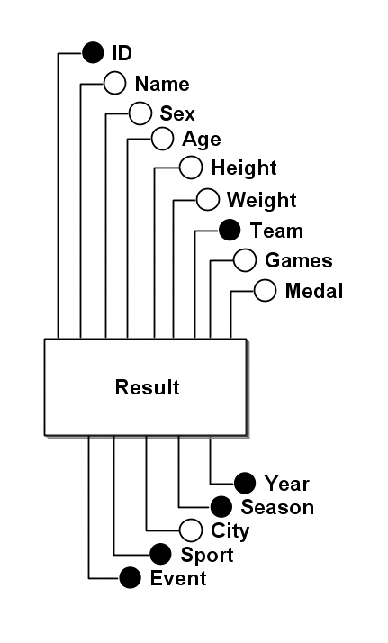
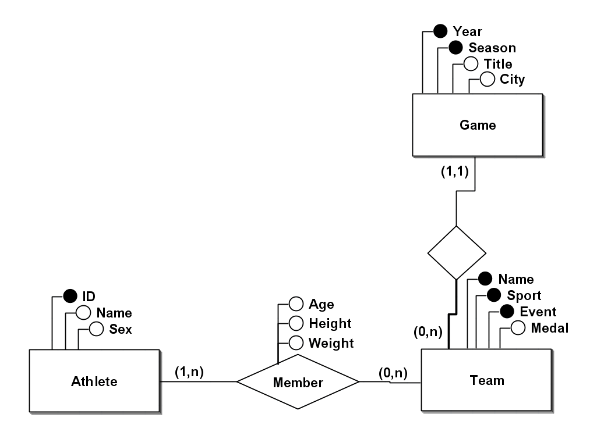
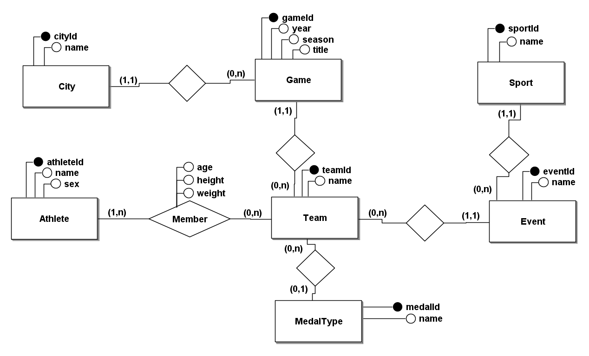

# Processo de Normalização do Banco de Dados dos Jogos Olímpicos da Grã-Bretanha

## Introdução

Este documento descreve o processo de normalização de um banco de dados de Jogos Olímpicos, detalhando as etapas realizadas para transformar a tabela original em um modelo final normalizado. A fonte dos dados foi a tabela athlete_events, retirada do site [kaggle](https://www.kaggle.com/datasets/heesoo37/120-years-of-olympic-history-athletes-and-results), estamos utilizando somente os valores referentes à Grã-Bretanha (Great Britain).

## Normalização

## 1FN

Esta foi a tabela retirada do site [kaggle](https://www.kaggle.com/datasets/heesoo37/120-years-of-olympic-history-athletes-and-results).
A partir dessa tabela que realizamos as demais alterações e o processo de normalização para a 2FN e 3FN.

Result (**ID**, Name, Sex, Age, Height, Weight, **Team**, **NOC**, Games, **Year**, **Season**, City, **Sport**, **Event**, Medal)

## 2FN e 3FN

Para alcançar a 2FN e 3FN, identificamos as dependências funcionais e decompusemos a tabela original em tabelas menores que eliminam redundâncias. Essas dependencias podem ser vistas em [Dependências funcionais](#dependências-funcionais).

- Athlete(**ID**, Name, Sex)
- Game(**Season**, **Year**, Title, City)
- Team(**Season**, **Year**, **Sport**, **Event**, **Name**, Medal)
    -(**Season**, **Year**) referencia Game
- Member(**ID**, **Season**, **Year**, **Sport**, **Event**, **Name**, Age, Height, Weight
    - **ID** referencia Athlete
    - (**Season**, **Year**, **Sport**, **Event**, **Name**) referencia Team

### Dependências funcionais

Durante o processo de normalização do banco de dados dos Jogos Olímpicos, identificamos várias dependências funcionais. Primeiramente, na tabela de Atletas, indetificou-se que o ID único de cada atleta determina funcionalmente seu nome e sexo. Em seguida, na tabela de Jogos, a combinação de temporada e ano determina funcionalmente o número de jogos realizados e a cidade onde ocorreram. Na tabela de Equipes, notou-se que a combinação de equipe, temporada, ano, esporte e evento está funcionalmente associada ao tipo de medalha conquistada. Por fim, na tabela de Membros, analisou-se que cada membro de uma equipe em um determinado evento esportivo e temporada está funcionalmente associado à sua idade, altura e peso, facilitando análises detalhadas sobre as características físicas dos atletas participantes. A identificação das dependências funcionais é fundamental para garantir a integridade dos dados e otimizar a estrutura do banco de dados, para consultas e alterações dos campos da tabela.

- Athlete: **ID** $\rightarrow$  Name, Sex
- Game: **Season**, **Year** $\rightarrow$  Games, City
- Team: **Team**, **Season**, **Year**, **Sport**, **Event** $\rightarrow$  Medal
- Membership: **ID**, **Team**, **Team**, **Season**, **Year**, **Sport**, **Event** $\rightarrow$ Age, Height, Weight

## Modelo final

No modelo final, o banco de dados foi decomposto em tabelas independentes, cada uma representando uma entidade específica, e as relações entre essas entidades foram definidas.

- Athlete(**athleteId**, name, sex)
- City(**cityId**, name)
- Sport(**sportId**, name)
- Event(**eventId**, sportId, name)
    - **sportId** referencia Sport
- MedalType(**medalId**, name)
- Edition(**editionId**, cityId, year, season, title)
    - **cityId** referencia City
- Team(**teamId**, name, editionId, eventId, medalTypeId)
    - **editionId** referencia Edition
    - **eventId** referencia Event
    - **medalTypeId** referencia MedalType
- Member(**athleteId**, **teamId**, age, height, weight)
    - **athleteId** referencia Athlete
    - **teamId** referencia Team

## Considerações Finais

A normalização do banco de dados visou melhorar a integridade e a eficiência na armazenagem dos dados, eliminando redundâncias e garantindo que as relações entre os dados fossem preservadas de maneira clara e eficiente. Facilitando consultas e análises sobre os Jogos Olímpicos e os atletas da Grã-Bretanha.

