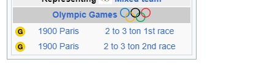
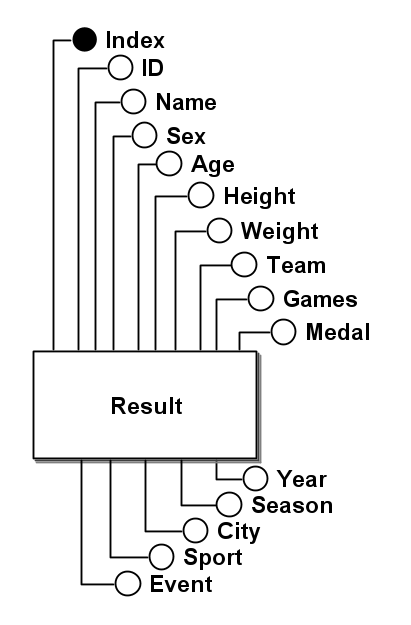
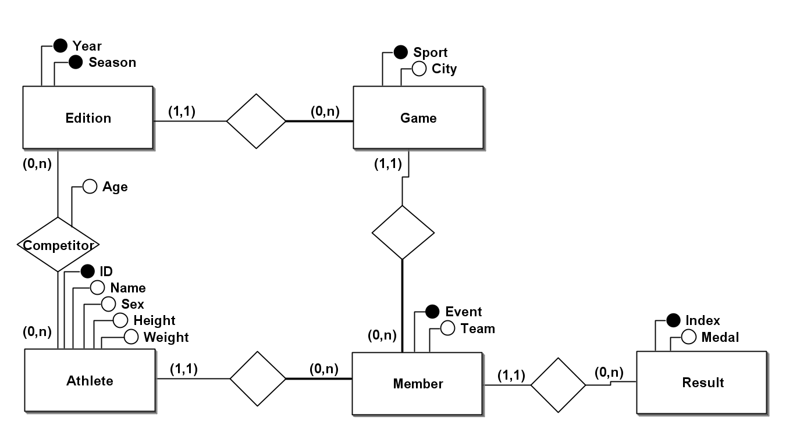
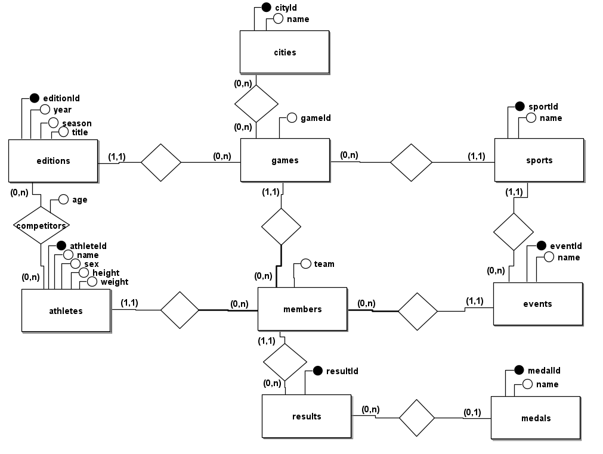

# Criação de Banco de Dados dos Jogos Olímpicos e atletas da Grã-Bretanha

Trabalho desenvolvido por:
 - Jaime Antonio Daniel Filho
 - Guilherme Meneghetti Einloft
 - Luís Gustavo Werle Tozevich

## Problemas

Durante o processo de normalização, identificamos a presença de dados duplicados na tabela original. Inicialmente, supôs-se que isso poderia ser um erro no banco de dados. No entanto, percebemos que se tratava da mesma pessoa ganhando a mesma medalha na mesma edição, evento e modalidade dos Jogos Olímpicos. Este fenômeno ocorre devido às práticas das antigas Olimpíadas, onde várias rodadas da mesma modalidade e esporte podiam ocorrer, todas válidas para a concessão de medalhas naquela edição específica dos Jogos. Um exemplo destacado pode ser visto [aqui](https://en.wikipedia.org/wiki/William_Exshaw) Portanto, para resolver essa questão, optamos por utilizar apenas um índice como chave primária na tabela da primeira forma normal, pois todos os outros campos podem ser idênticos.

 Além disso, durante a análise dos dados, observamos casos em que o mesmo atleta recebeu medalhas diferentes na mesma modalidade esportiva e na mesma edição dos Jogos Olímpicos. Um exemplo disso pode ser visto na Olimpíada de 1900, conforme detalhado [aqui](https://no.wikipedia.org/wiki/Algernon_Maudsley#Referanser).

Exemplo dos dados encontrados na tabela:
```
"33564","William Edgar Exshaw","M",34,NA,NA,"Olle","GBR","1900 Summer",1900,"Summer","Paris","Sailing","Sailing Mixed 2-3 Ton","Gold"
"33564","William Edgar Exshaw","M",34,NA,NA,"Olle","GBR","1900 Summer",1900,"Summer","Paris","Sailing","Sailing Mixed 2-3 Ton","Gold"
```


Além disso, identificamos situações em que diferentes edições dos Jogos Olímpicos ocorreram em cidades distintas para o mesmo esporte. Para resolver essa questão, associamos cada modalidade esportiva à cidade correspondente, assegurando uma representação precisa das localizações dos eventos esportivos.

## Introdução

Este documento descreve o processo de criação e normalização de um banco de dados de Jogos Olímpicos, detalhando as etapas realizadas para transformar a tabela original em um modelo final. A fonte dos dados foi a tabela athlete_events, retirada do site [kaggle](https://www.kaggle.com/datasets/heesoo37/120-years-of-olympic-history-athletes-and-results), estamos utilizando somente os valores referentes à Grã-Bretanha (Great Britain).

Foram identificadas e organizadas informações de um total de 6281 atletas distintos representando a Grã-Bretanha, os quais participaram das Olimpíadas ao longo de diversas edições.

## Normalização

## 1FN

Esta foi a tabela retirada do site [kaggle](https://www.kaggle.com/datasets/heesoo37/120-years-of-olympic-history-athletes-and-results).
A partir dessa tabela que realizamos as demais alterações e o processo de normalização para a 2FN e 3FN.

- Result(<u>Index</u>, ID, Name, Sex, Age, Height, Weight, Team, NOC, Games, Year, Season, City, Sport, Event, Medal)



## 3FN

Para alcançar a 3FN, identificamos as dependências transitivas e decompusemos a tabela original em tabelas menores que eliminam redundâncias. Essas dependencias podem ser vistas em [dependências transtivas](#dependências-transitivas).



### Dependências transitivas

Durante o processo de normalização do banco de dados dos Jogos Olímpicos da Grã-Bretanha, identificamos diversas dependências transitivas que orientaram a decomposição da tabela original em estruturas mais eficientes e sem redundâncias. Inicialmente, observamos que o ID único de cada atleta determina seu nome, sexo, altura e peso. Além disso, analisamos que a combinação de ano e temporada determina o número de jogos realizados (Games), enquanto a inclusão do esporte acrescenta a informação da cidade onde esses eventos ocorreram. Outra dependência identificada foi a relação entre o ID do atleta, o ano, a temporada, o esporte e o evento, que determina a equipe em que o atleta competiu.

- ID $\rightarrow$  Name, Sex, Height, Weight
- Year, Season $\rightarrow$ Games
- Year, Season, Sport $\rightarrow$ City
- ID, Season, Year $\rightarrow$ Age
- ID, Year, Season, Sport, Event $\rightarrow$ Team

## Modelo final

No modelo final, o banco de dados foi decomposto em tabelas independentes, cada uma representando uma entidade específica, e as relações entre essas entidades foram definidas.



## Considerações Finais

A normalização do banco de dados visou melhorar a integridade e a eficiência na armazenagem dos dados, eliminando redundâncias e garantindo que as relações entre os dados fossem preservadas de maneira clara e eficiente. Facilitando consultas e análises sobre os Jogos Olímpicos e os atletas da Grã-Bretanha.


