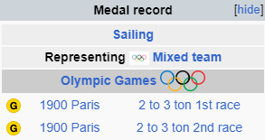
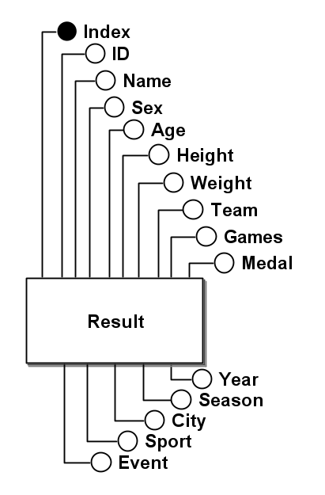
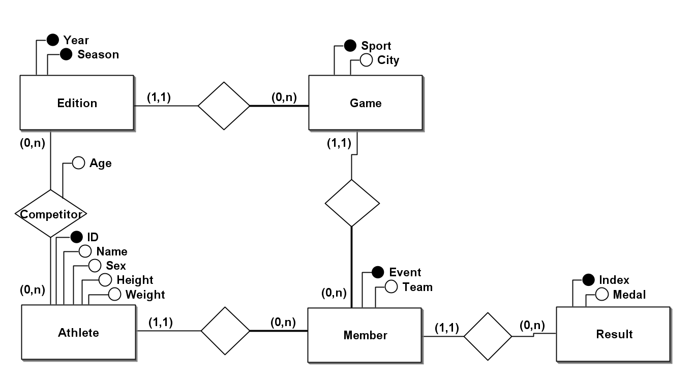
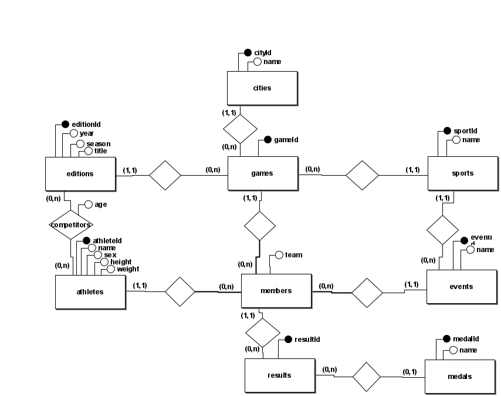

# Criação de Banco de Dados dos Jogos Olímpicos e atletas da Grã-Bretanha

Trabalho desenvolvido por:
 - Jaime Antonio Daniel Filho
 - Guilherme Meneghetti Einloft
 - Luís Gustavo Werle Tozevich

## Introdução

Este documento descreve o processo de criação e normalização de um banco de dados de Jogos Olímpicos, detalhando as etapas realizadas para transformar a tabela original em um modelo final. A fonte dos dados foi a tabela "athlete_events", retirada do site [kaggle](https://www.kaggle.com/datasets/heesoo37/120-years-of-olympic-history-athletes-and-results) e filtrada para somente exibir os valores referentes à Grã-Bretanha, isto é, com "NOC" igual à "GRB".

Foram identificadas e organizadas informações de um total de 6281 atletas distintos representando a Grã-Bretanha, os quais participaram das Olimpíadas ao longo de diversas edições.

## Problemas

Durante o processo de normalização, identificamos a presença de dados duplicados na tabela original. Inicialmente, supôs-se que isso poderia ser um erro em nossa fonte. No entanto, percebemos que se tratava da mesma pessoa ganhando a mesma medalha na mesma edição, no mesmo esporte e na mesma modalidade. Este fenômeno ocorre devido a certas práticas em Jogos Olímpicos antigos, onde podiam ocorrer várias rodadas da mesma modalidade esportiva, todas válidas para a concessão de medalhas naquela edição específica. Um exemplo desse problema pode ser visto na enciclopédia do atleta [William Exshaw](https://en.wikipedia.org/wiki/William_Exshaw). Desse modo, para resolver essa questão, optamos por utilizar um índice como chave primária na tabela da primeira forma normal, pois todos os outros campos podem ser idênticos.

<p align="center">
    
</p>

A duplicidade pode ser observada nas seguintes linhas da tabela:

```csv
"33564","William Edgar Exshaw","M",34,NA,NA,"Olle","GBR","1900 Summer",1900,"Summer","Paris","Sailing","Sailing Mixed 2-3 Ton","Gold"
"33564","William Edgar Exshaw","M",34,NA,NA,"Olle","GBR","1900 Summer",1900,"Summer","Paris","Sailing","Sailing Mixed 2-3 Ton","Gold"
```

Além disso, identificamos situações em que a mesma edição dos Jogos Olímpicos ocorreu em cidades distintas. As [olímpiadas de verão de 1956](https://en.wikipedia.org/wiki/1956_Summer_Olympics), por exemplo, ocorreram em Melbourne, Austrália, e Estocolmo, Suécia. Isso foi resolvido associando uma cidade para cada par edição e esporte, assegurando uma representação precisa das localizações dos eventos esportivos.

## Normalização

### 1FN e 2FN

Construímos o nosso modelo a partir da tabela retirada do site [kaggle](https://www.kaggle.com/datasets/heesoo37/120-years-of-olympic-history-athletes-and-results), adicionando uma coluna "Index" para resolver a duplicidade descrita anteriormente. A coluna "NOC" foi utilizada para filtrar os atletas que representam a Grã-Bretanha e, logo, foi retirada da 1FN.

#### Abordagem relacional

- Result(<u>Index</u>, ID, Name, Sex, Age, Height, Weight, Team, Games, Year, Season, City, Sport, Event, Medal)

#### Diagrama ER

<p align="center">
    
</p>

### 3FN

Para alcançar a 3FN, decompusemos a tabela original em tabelas menores que eliminam redundâncias com base nas dependências transitivas identificadas abaixo:

- ID -> Name, Sex, Height, Weight
- Year, Season -> Games
- Year, Season, Sport -> City
- ID, Year, Season -> Age
- ID, Year, Season, Sport, Event -> Team

#### Abordagem relacional

- Athlete(<u>ID</u>, Name, Sex, Height, Weight)

- Edition(<u>Year</u>, <u>Season</u>)

- Competitor(<u>ID</u>, <u>Year</u>, <u>Season</u>)
    - ID referencia Athlete
    - (Year, Season) referenciam Edition

- Game(<u>Year</u>, <u>Season</u>, <u>Sport</u>, City)
    - (Year, Season) referenciam Edition

- Member(<u>ID</u>, <u>Year</u>, <u>Season</u>, <u>Sport</u>, <u>Event</u>, Team)
    - ID referencia Athlete
    - Year, Season, Sport referenciam Game

- Result(<u>Index</u>, ID, Year, Season, Sport, Event, Medal)
    - (ID, Year, Season, Sport, Event) referenciam Member

#### Diagrama ER

<p align="center">
    
</p>

## Modelo final

No modelo final, o banco de dados foi decomposto em várias tabelas independentes com o uso de identificadores artificiais para facilitar a criação de consultas e a aplicação de mudanças no modelo.

A tabela "athletes" armazena informações básicas sobre os atletas, incluindo a identificação extraída da tabela original, nome, sexo, altura e peso. As cidades que sediaram os jogos são registradas na tabela "cities", enquanto os diferentes esportes são listados na tabela "sports". As modalidades de cada esporte foram especificadas na tabela "events".

A tabela "medals" define os tipos de medalhas que podem ser conquistadas, como ouro, prata e bronze. As diferentes edições dos Jogos Olímpicos são documentadas na tabela "editions", que inclui o ano, a estação (verão ou inverno) e o título da edição.

A tabela "games" é central para a ligação entre edições, esportes e cidades, relacionando onde cada esporte ocorreu numa determinada edição. Os atletas que competiram em alguma edição dos Jogos Olímpicos são listados na tabela "competitors", que também registra a idade dos atletas durante a competição.

A tabela "members" detalha a participação dos atletas em modalides esportivas específicas dentro de cada jogo, incluindo o nome da equipe pela qual competiram. Finalmente, a tabela "results" armazena os resultados das competições, ligando atletas, jogos e modalidades esportivas com as medalhas conquistadas.

<p align="center">
    
</p>